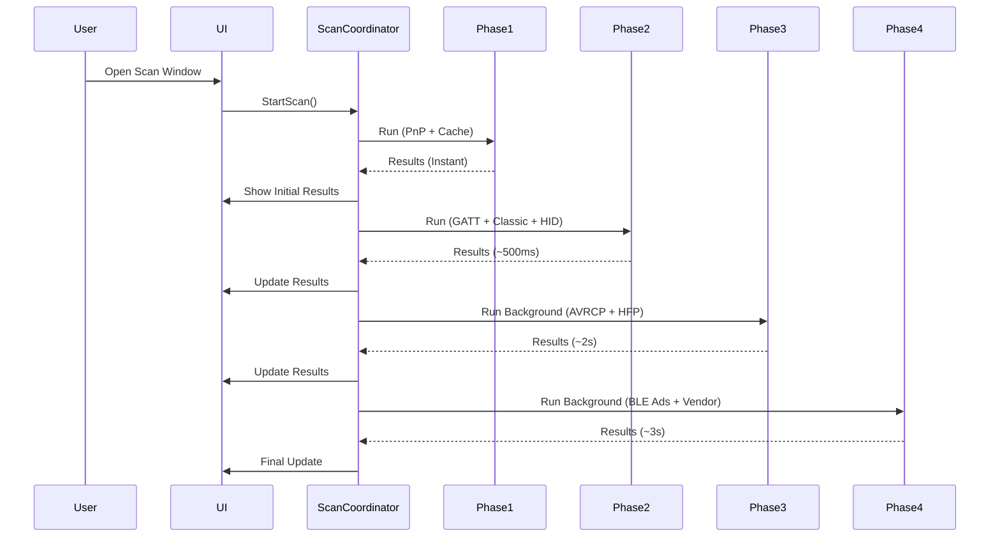

# Feature Plan: Expand Bluetooth Device Discovery and Battery State Capture

---

## Goal

Expand the range of Bluetooth devices that can be discovered and have their battery states monitored by incorporating additional methods beyond the existing **GATT Battery Service (0x180F)** and **Classic Bluetooth (SetupAPI + WMI)** approaches. This plan aims to maximize device coverage while adhering to the existing architecture, design decisions, and polling-based monitoring strategy.

---

## Background and Constraints

### Current Implementation
The project currently supports two methods for monitoring Bluetooth device battery states:

| Method | Transport | Battery Level | Charging State | Source |
|--------|-----------|---------------|----------------|--------|
| **GATT Battery Service** | BLE | ✅ `0x2A19` | ⚠️ `0x2BEA` (optional, rare) | `Windows.Devices.Bluetooth.GenericAttributeProfile` |
| **Classic Bluetooth (SetupAPI + WMI)** | Classic BT | ✅ `Win32_Battery.EstimatedChargeRemaining` | ✅ `Win32_Battery.BatteryStatus == 2` | SetupAPI P/Invoke + WMI |

### Limitations
- **GATT Battery Service (`0x180F`)** is not universally supported by all BLE devices.
- **Classic Bluetooth (SetupAPI + WMI)** relies on Windows device enumeration, which may not always report battery levels for all devices, especially when not actively connected.
- Some devices (e.g., HID devices, audio devices, or vendor-specific peripherals) use alternative methods to expose battery state.

### Key Observations
- **HID Devices (Keyboards, Mice, Gamepads):** Often report battery via **HID reports** or **vendor-specific GATT characteristics**.
- **Audio Devices (Headphones, Speakers):** May use **AVRCP (Audio/Video Remote Control Profile)** or **HFP (Hands-Free Profile)** or **vendor-specific protocols** (e.g., Sony, Bose).
- **BLE Advertisements:** Some devices broadcast battery level in **manufacturer data** or **service data** within BLE advertisements.
- **Vendor-Specific APIs:** Manufacturers like Intel, Broadcom, or Qualcomm provide proprietary SDKs for advanced Bluetooth features, including battery monitoring.
- **PnP Device Watcher:** Windows provides a **`DeviceWatcher`** API to monitor Plug and Play (PnP) events for Bluetooth devices, which can detect connection/disconnection and property changes.

---

## Design Decisions That Govern This Feature

### ADR-001 — Single Non-Nullable Constructor per Class
All data models (e.g., `DeviceBatteryInfo`) must adhere to the principle of **immutability** and **single non-nullable constructors**. Any new fields (e.g., `IsCharging`, `BatterySource`) must be added as optional parameters with defaults to avoid breaking existing code.

**Rule:** New fields in `DeviceBatteryInfo` or related records must be added as optional constructor parameters with default values (e.g., `bool? IsCharging = null`).

---

### ADR-002 — Dual Bluetooth Reader Strategy
The existing architecture isolates **GATT** and **Classic Bluetooth** readers as independent implementations of `IBatteryReader`. This isolation must be preserved. New methods for battery monitoring (e.g., HID, AVRCP, BLE advertisements) must be implemented as **separate readers** or **extensions to existing readers**, but they must not couple the GATT and Classic strategies.

**Rule:** New battery monitoring methods must be implemented as:
- A new `IBatteryReader` implementation (e.g., `HidBatteryReader`, `AvrcpBatteryReader`), **or**
- An extension to an existing reader (e.g., adding BLE advertisement scanning to `GattBatteryReader`), **but only if the extension is logically aligned with the existing reader's responsibilities**.

---
### ADR-003 — Polling Over Push
The project uses a **polling-based approach** (60-second interval) for battery monitoring, as documented in [ADR-003](docs/adr/adr-003-polling-over-push.md). This decision must be respected:
- **No event-driven subscriptions** (e.g., GATT notifications) are introduced for battery monitoring.
- **Polling intervals** may be adjusted for specific methods (e.g., BLE advertisements may require more frequent scanning).
- **Cache invalidation** must be handled for stale connections (e.g., `GattConnectionCache.RemoveDevice` for GATT devices).

**Rule:** All new battery monitoring methods must integrate into the existing **60-second polling cycle** or define a justified alternative interval.

---

### ADR-004 — Threshold Hysteresis
The `PollingOrchestrator` is the **single source of truth** for alert state classification (e.g., `BatteryAlertState.Normal`, `Low`, `High`). Any new battery data (e.g., from HID or AVRCP) must be processed through the same hysteresis logic.

**Rule:** New battery monitoring methods must feed data into `PollingOrchestrator` via the existing `DeviceAggregationPipeline`. No new alert logic may be introduced outside `PollingOrchestrator`.

---

### ADR-010 — SynchronizationContext Over Control.Invoke
All UI updates must be dispatched through the existing `SynchronizationContext.Post` pattern (via `ScanCoordinator`). No direct `Control.Invoke` or `Dispatcher.Invoke` calls may be introduced.

**Rule:** New UI updates (e.g., displaying battery data from HID devices) must use the existing `PostToUi` pattern.

---

### ADR-011 — Single Source of Alert Truth
The `PollingOrchestrator` remains the **only authority** on alert state. New battery data sources must not introduce separate alert logic.

**Rule:** All battery data, regardless of source, must be processed by `PollingOrchestrator.ClassifyBatteryState`.

---

### ADR-012 — Two Distinct Settings Events
Settings changes (e.g., thresholds, ignored devices) are propagated via the existing `ThresholdSettings.Changed` event. New battery monitoring methods must not introduce new settings events unless absolutely necessary.

**Rule:** If new settings are required (e.g., to enable/disable a specific monitoring method), they must be added to `ThresholdSettings` and use the existing event mechanism.

---

## Technical Specification: Phased Scanning for Bluetooth Battery Monitoring

### Goal
Ensure that adding multiple new Bluetooth battery monitoring protocols **does not degrade UX performance** (e.g., slow discovery, UI freezes, or Bluetooth radio contention). This is achieved through a **phased scanning approach**, where fast and high-success protocols run first, followed by slower or optional protocols in the background.

---

### Background
Before optimizations, discovery took **3–5 seconds**, which was unacceptable for users. After optimizations, discovery is **fast and responsive**. Adding 6+ new protocols risks **reintroducing latency** if not implemented carefully.

**Key Insight:**
- **~80% of devices** are covered by **GATT, Classic, and HID** (fast protocols).
- **~20% of devices** require **AVRCP, HFP, or BLE Ads** (slower protocols).
- **Users expect immediate feedback** when opening the scan window.

---

### Requirements
1. **Fast Initial Results:**
   - Users must see **some battery data within 200–500ms** of opening the scan window.
2. **Non-Blocking UI:**
   - The UI must **never freeze** during a scan.
3. **No Bluetooth Radio Contention:**
   - Scans must not **interfere with active Bluetooth connections** (e.g., audio streaming, file transfers).
4. **Graceful Degradation:**
   - If a protocol fails or is slow, the scan must **continue without it**.
5. **Configurable Behavior:**
   - Users must be able to **disable slow protocols** if they experience issues.

---

### Design

#### 1. Phased Scanning Model
Scanning is divided into **4 phases**, each with a **time budget** and **priority level**:

| Phase | Protocols | Time Budget | Priority | User Visibility | Notes |
|-------|-----------|-------------|----------|-----------------|-------|
| 1 | PnP Watcher, Cached Data | ~50ms | Highest | Instant | Background-triggered or cached. |
| 2 | GATT (known devices), Classic, HID | ~200–500ms | High | Immediate | Fast, high-success protocols. |
| 3 | AVRCP, HFP | ~500ms–2s | Medium | Delayed | Slower, lower-success protocols. |
| 4 | BLE Ads, Vendor-Specific | ~1–3s | Low | Background | Optional, user-triggered. |

**Workflow:**


---

#### 2. Protocol Prioritization
Protocols are **prioritized by speed and success rate**:

| Protocol | Speed | Success Rate | Priority | Phase |
|----------|-------|--------------|----------|-------|
| PnP Watcher | ⚡ Instant | 90%+ | 1 | 1 |
| Cached Data | ⚡ Instant | 100% | 1 | 1 |
| GATT (Known Devices) | ⚡ Fast | 80% | 2 | 2 |
| Classic Bluetooth | ⚡ Fast | 70% | 2 | 2 |
| HID | ⚡ Fast | 60% | 2 | 2 |
| AVRCP | 🐢 Medium | 40% | 3 | 3 |
| HFP | 🐢 Slow | 20% | 3 | 3 |
| BLE Ads | ⚡ Fast* | 30% | 4 | 4 |
| Vendor-Specific | 🐢 Slow | 10% | 4 | 4 |

**"*BLE Ads is fast per-scan but requires frequent scans (high radio load).**

---

#### 3. Implementation Details

##### 3.1 Phase 1: Instant Results
**Goal:** Show **cached or PnP-triggered results immediately**.

**Components:**
- **`BatteryCache`:** Stores last-known battery levels for devices (TTL: 5–10 minutes).
- **`DeviceWatcherService`:** Triggers scans when devices are connected/disconnected.

**Code:**
```csharp
// In ScanCoordinator
public async Task StartScanAsync(bool isUserTriggered = false)
{
    // Phase 1: Instant results
    ShowCachedResults();
    await _deviceWatcherService.TriggerScanIfNewDeviceAsync();

    // Phase 2: Fast protocols
    await RunPhase2Async();

    // Phase 3: Medium protocols (background)
    _ = RunPhase3Async();

    // Phase 4: Slow protocols (background, only if user-triggered)
    if (isUserTriggered)
    {
        _ = RunPhase4Async();
    }
}
```

**Files Modified:**
- `src/Tray/ScanCoordinator.cs` (Add phased scanning logic).
- `src/Monitoring/BatteryCache.cs` (New file: Caching layer).

---

##### 3.2 Phase 2: Fast Protocols
**Goal:** Scan **GATT (known devices), Classic, and HID** in parallel.

**Components:**
- **`GattBatteryReader`:** Only scan devices that **previously reported battery via GATT** (cached list).
- **`ClassicBatteryReader`:** Scan all paired Classic Bluetooth devices.
- **`HidBatteryReader`:** Scan all HID devices.

**Code:**
```csharp
private async Task RunPhase2Async()
{
    var gattTask = _gattBatteryReader.ScanKnownDevicesAsync();
    var classicTask = _classicBatteryReader.ScanAsync();
    var hidTask = _hidBatteryReader.ScanAsync();

    var results = await Task.WhenAll(gattTask, classicTask, hidTask);
    UpdateUI(results.Flatten());
}
```

**Optimizations:**
- **Limit GATT to known devices** (avoid full discovery every time).
- **Use `Task.WhenAll`** for parallel execution.

**Files Modified:**
- `src/Monitoring/GattBatteryReader.cs` (Add `ScanKnownDevicesAsync`).

---

##### 3.3 Phase 3: Medium Protocols (Background)
**Goal:** Scan **AVRCP and HFP** in the background without blocking the UI.

**Components:**
- **`AvrcpBatteryReader`:** Scan all paired audio devices.
- **`HfpBatteryReader`:** Scan all paired HFP devices.

**Code:**
```csharp
private async Task RunPhase3Async()
{
    try
    {
        var avrcpTask = _avrcpBatteryReader.ScanAsync();
        var hfpTask = _hfpBatteryReader.ScanAsync();
        var results = await Task.WhenAll(avrcpTask, hfpTask);
        UpdateUI(results.Flatten());
    }
    catch (Exception ex)
    {
        Log.Warning(ex, "Phase 3 scan failed");
    }
}
```

**Optimizations:**
- **Run on a background thread** (via `Task.Run` if needed).
- **Timeout after 2 seconds** per protocol.

**Files Modified:**
- `src/Tray/ScanCoordinator.cs` (Add background task handling).

---

##### 3.4 Phase 4: Slow Protocols (Optional)
**Goal:** Scan **BLE Ads and Vendor-Specific APIs** only if explicitly requested.

**Components:**
- **`BleAdvertisementBatteryReader`:** Scan for BLE advertisements (throttled).
- **`VendorBatteryReader`:** Scan for vendor-specific devices (if enabled).

**Code:**
```csharp
private async Task RunPhase4Async()
{
    if (!_settings.EnableBleAdvertisementMonitoring && !_settings.EnableVendorBatteryMonitoring)
    {
        return;
    }

    var tasks = new List<Task<IReadOnlyList<DeviceBatteryInfo>>>();
    if (_settings.EnableBleAdvertisementMonitoring)
    {
        tasks.Add(_bleAdvertisementBatteryReader.ScanAsync());
    }
    if (_settings.EnableVendorBatteryMonitoring)
    {
        tasks.Add(_vendorBatteryReader.ScanAsync());
    }

    var results = await Task.WhenAll(tasks);
    UpdateUI(results.Flatten());
}
```

**Optimizations:**
- **Disabled by default** (user must opt-in).
- **Throttle BLE Ads** (e.g., every 30 seconds).

**Files Modified:**
- `src/Settings/ThresholdSettings.cs` (Add `EnableBleAdvertisementMonitoring` and `EnableVendorBatteryMonitoring`).

---

#### 4. Bluetooth Radio Throttling
**Goal:** Prevent **radio contention** by limiting concurrent Bluetooth operations.

**Implementation:**
- Use a **`SemaphoreSlim`** to limit concurrent Bluetooth operations (e.g., max 2–3 at once).

**Code:**
```csharp
// In BluetoothBatteryMonitor or ScanCoordinator
private static readonly SemaphoreSlim _bluetoothSemaphore = new(2); // Max 2 concurrent BT operations

public async Task<int?> ReadBatteryAsync(Device device)
{
    await _bluetoothSemaphore.WaitAsync();
    try
    {
        return await device.ReadBatteryAsync();
    }
    finally
    {
        _bluetoothSemaphore.Release();
    }
}
```

**Files Modified:**
- `src/Monitoring/BluetoothBatteryMonitor.cs` (Add semaphore).

---

#### 5. Deduplication
**Goal:** Avoid showing the **same device multiple times** in the UI.

**Implementation:**
- **Use `DeviceId` as the primary key** (fall back to MAC address for BLE Ads).
- **Prioritize data sources** (GATT/Classic > HID > AVRCP/HFP > BLE Ads).

**Code:**
```csharp
// In DeviceAggregationPipeline
public IReadOnlyList<DeviceBatteryInfo> MergeAndDeduplicate(IEnumerable<DeviceBatteryInfo> allResults)
{
    var merged = new Dictionary<string, DeviceBatteryInfo>();
    var sourcePriority = new Dictionary<BatterySource, int>
    {
        { BatterySource.Gatt, 0 },
        { BatterySource.Classic, 0 },
        { BatterySource.Hid, 1 },
        { BatterySource.Avrcp, 2 },
        { BatterySource.Hfp, 2 },
        { BatterySource.BleAdvertisement, 3 },
        { BatterySource.VendorSpecific, 3 },
        { BatterySource.Unknown, 4 }
    };

    foreach (var result in allResults)
    {
        if (!merged.TryGetValue(result.DeviceId, out var existing) ||
            sourcePriority[result.Source] < sourcePriority[existing.Source])
        {
            merged[result.DeviceId] = result;
        }
    }
    return merged.Values.ToList();
}
```

**Files Modified:**
- `src/Monitoring/DeviceAggregationPipeline.cs` (Add deduplication logic).

---

#### 6. Caching
**Goal:** Avoid **re-scanning devices that haven’t changed**.

**Implementation:**
- **Cache battery levels** for **5–10 minutes** (battery doesn’t change quickly).
- **Invalidate cache** if:
  - Device **disconnects/reconnects** (via PnP Watcher).
  - User **manually triggers a scan**.
  - Battery **drops below a threshold** (e.g., <20%).

**Code:**
```csharp
// In BatteryCache.cs
public class BatteryCache
{
    private readonly Dictionary<string, (int? Battery, DateTimeOffset Timestamp)> _cache = new();
    private readonly TimeSpan _cacheTTL = TimeSpan.FromMinutes(5);

    public bool TryGetCachedBattery(string deviceId, out int? battery)
    {
        if (_cache.TryGetValue(deviceId, out var entry) &&
            DateTimeOffset.UtcNow - entry.Timestamp < _cacheTTL)
        {
            battery = entry.Battery;
            return true;
        }
        battery = null;
        return false;
    }

    public void UpdateCache(string deviceId, int? battery)
    {
        _cache[deviceId] = (battery, DateTimeOffset.UtcNow);
    }

    public void InvalidateCache(string deviceId)
    {
        _cache.Remove(deviceId);
    }
}
```

**Files Modified:**
- `src/Monitoring/BatteryCache.cs` (New file).
- `src/Monitoring/DeviceAggregationPipeline.cs` (Integrate cache).

---

#### 7. Timeout and Graceful Degradation
**Goal:** Ensure **no protocol hangs the UI**.

**Implementation:**
- **Timeout after 2 seconds** per protocol.
- **Fallback to cached data** if a protocol fails.

**Code:**
```csharp
// In ScanCoordinator
private async Task<IReadOnlyList<DeviceBatteryInfo>> RunWithTimeoutAsync(
    Func<CancellationToken, Task<IReadOnlyList<DeviceBatteryInfo>>> scanFunc,
    string protocolName)
{
    using var cts = new CancellationTokenSource(TimeSpan.FromSeconds(2));
    try
    {
        return await scanFunc(cts.Token);
    }
    catch (OperationCanceledException)
    {
        Log.Warning($"{protocolName} scan timed out");
        return Array.Empty<DeviceBatteryInfo>();
    }
    catch (Exception ex)
    {
        Log.Error(ex, $"{protocolName} scan failed");
        return Array.Empty<DeviceBatteryInfo>();
    }
}
```

**Files Modified:**
- `src/Tray/ScanCoordinator.cs` (Add timeout handling).

---

#### 8. Throttling Background Scans
**Goal:** Prevent **battery drain** and **CPU overload** from background scans.

**Implementation:**
- **BLE Advertisement Scanning:**
  - **Default interval: 30 seconds** (configurable).
  - **Pause if:**
    - Laptop is on **battery power** (not AC).
    - Bluetooth radio is **busy** (e.g., file transfer, audio streaming).
- **PnP Watcher:**
  - **Always on** (low overhead).
- **Polling Intervals:**
  - **Default: 60 seconds** (as per ADR-003).
  - **Increase to 120 seconds** if system is **idle** (no user activity).

**Code:**
```csharp
// In BluetoothBatteryMonitor
private async void OnTimerTick()
{
    if (PowerStatus.IsBatteryPower && !UserIsActive)
    {
        // Skip scan if on battery and user is idle
        return;
    }
    await PollAsync();
}

// In BleAdvertisementBatteryReader
public async Task<IReadOnlyList<DeviceBatteryInfo>> ScanAsync()
{
    if (PowerStatus.IsBatteryPower)
    {
        return Array.Empty<DeviceBatteryInfo>(); // Skip on battery
    }
    // ... rest of scan logic
}
```

**Files Modified:**
- `src/Monitoring/BluetoothBatteryMonitor.cs` (Add power-aware throttling).
- `src/Monitoring/BleAdvertisementBatteryReader.cs` (Skip on battery power).

---

#### 9. User Feedback for Slow Operations
**Goal:** Set **expectations** if a scan takes longer than usual.

**Implementation:**
- **Show a loading spinner** in the scan window.
- **Progress Updates:**
  - "Scanning GATT devices… (3/5 found)"
  - "Checking HID devices… (1/2 found)"
- **Estimated Time Remaining:**
  - If a scan takes >1s, show **"This may take a few seconds…"**.

**Code:**
```csharp
// In ScanWindow.cs
private void UpdateScanStatus(string message)
{
    _statusLabel.Text = message;
    _progressBar.Style = ProgressBarStyle.Marquee;
}

// In ScanCoordinator.cs
private async Task RunPhase2Async()
{
    UpdateScanStatus("Scanning fast protocols…");
    var results = await RunPhase2CoreAsync();
    UpdateScanStatus("Updating results…");
    UpdateUI(results);
    UpdateScanStatus("Ready");
}
```

**Files Modified:**
- `src/Tray/ScanWindow.cs` (Add status updates).

---

### Testing Requirements
1. **Performance Tests:**
   - Measure **discovery time** with all protocols enabled.
   - Verify **<200ms for Phase 1**, **<500ms for Phase 2**, **<2s for Phase 3**.
2. **Stress Tests:**
   - Simulate **10+ Bluetooth devices** and verify **no UI freezes**.
   - Test **BLE Ads + GATT + AVRCP simultaneously** and verify **no radio contention**.
3. **Battery Tests:**
   - Run **BLE Ads scanning every 10s** on battery power and measure **battery impact**.
4. **User Tests:**
   - Validate that **Phase 1 results appear instantly**.
   - Validate that **slow protocols don’t block the UI**.

---

### Rollout Plan
1. **Phase 1:** Implement **PnP Watcher + Caching + Deduplication** (low risk).
2. **Phase 2:** Add **Phased Scanning (Phases 1–2)** and test performance.
3. **Phase 3:** Add **Phases 3–4** and monitor for issues.
4. **Phase 4:** Enable **BLE Ads and Vendor-Specific** as opt-in features.

---

### Open Questions
1. **Should Phase 3 (AVRCP/HFP) run on every poll cycle, or only on manual scans?**
   - **Proposed:** Run on every poll cycle but with a **timeout** (2s).
2. **Should BLE Ads scanning be limited to a subset of users (e.g., opt-in)?**
   - **Proposed:** Yes, disable by default and allow users to enable it.
3. **How to handle devices that are detected by multiple protocols?**
   - **Proposed:** Prioritize **GATT/Classic > HID > AVRCP/HFP > BLE Ads** and deduplicate in `DeviceAggregationPipeline`.

---

## Proposed Methods for Expanded Device Discovery and Battery Monitoring

The following methods are **realistic options** for expanding device coverage. Each method is evaluated for **feasibility**, **coverage**, and **alignment with existing design decisions**.

---

### Method 1: HID Battery Reporting
**Goal:** Capture battery state from **HID-class Bluetooth devices** (e.g., keyboards, mice, gamepads) that do not support the GATT Battery Service.

#### Background
- Many HID devices (e.g., Logitech, Microsoft, Razer) report battery via **HID reports** or **vendor-specific GATT characteristics**.
- Windows exposes HID device battery via **`Windows.Devices.HumanInterfaceDevice`** (UWP) or **Win32 HID APIs**.
- Some HID devices use the **`0x2A1B` (Battery Power State)** GATT characteristic, which is already partially supported in the existing GATT reader (see [plan-charging-indicator.md](docs/plans/plan-charging-indicator.md)).

#### Implementation
1. **Create a new `HidBatteryReader`** implementing `IBatteryReader`.
   - Use **`Windows.Devices.HumanInterfaceDevice`** (UWP) or **Win32 HID APIs** to enumerate HID devices.
   - For each HID device, attempt to read battery level from:
     - **HID reports** (vendor-specific usage pages).
     - **GATT `0x2A1B` (Battery Power State)** if the device supports BLE.
   - Return `DeviceBatteryInfo` with `Battery` and `IsCharging` (if available).

2. **Integrate into `DeviceAggregationPipeline`**:
   - Add `HidBatteryReader.ReadAllAsync` to the existing `Task.WhenAll` call in `DeviceAggregationPipeline.ReadMergedAsync`.
   - Merge results with GATT and Classic readers, deduplicating by `DeviceId`.

3. **Handle Cache Invalidation**:
   - HID devices do not require connection caching (unlike GATT), so no changes to `GattConnectionCache` are needed.

4. **UI Updates**:
   - No changes required. The existing `ScanWindow` and `TrayApp` will display battery data from `DeviceBatteryInfo`.

#### Files Changed
| File | Change |
|------|--------|
| `src/Monitoring/Hid/HidBatteryReader.cs` | New file: Implement `IBatteryReader` for HID devices. |
| `src/Monitoring/DeviceAggregationPipeline.cs` | Add `HidBatteryReader.ReadAllAsync` to the pipeline. |
| `src/Monitoring/IBatteryReader.cs` | No changes (interface already supports new reader). |

#### Acceptance Criteria
- HID devices (e.g., Logitech MX Master, Microsoft Sculpt Keyboard) that do not support GATT Battery Service now have their battery levels displayed in the scan window and tray tooltip.
- Battery data from HID devices is merged with GATT and Classic data, with no duplicates.
- No new UI logic is introduced; existing `DeviceBatteryInfo` handling suffices.

---

### Method 2: AVRCP Battery Reporting
**Goal:** Capture battery state from **audio devices** (e.g., headphones, speakers) that use the **AVRCP (Audio/Video Remote Control Profile)**.

#### Background
- AVRCP is a Bluetooth profile used for remote control of audio/video devices.
- Some audio devices (e.g., Sony WH-1000XM4, Bose QC45) report battery level via **AVRCP** or **vendor-specific extensions**.
- AVRCP battery reporting is **not standardized** and often vendor-specific.

#### Implementation
1. **Create a new `AvrcpBatteryReader`** implementing `IBatteryReader`.
   - Use **`Windows.Devices.Bluetooth.Rfcomm`** or **Win32 Bluetooth APIs** to interact with AVRCP.
   - For each paired audio device, attempt to read battery level via AVRCP commands.
   - Fall back to **vendor-specific GATT characteristics** (e.g., Sony's `0xFE00` service) if AVRCP is unavailable.

2. **Integrate into `DeviceAggregationPipeline`**:
   - Add `AvrcpBatteryReader.ReadAllAsync` to the pipeline.
   - Merge results with GATT, Classic, and HID readers.

3. **Handle Vendor-Specific Logic**:
   - Maintain a **mapping of vendor IDs to known battery characteristics** (e.g., Sony, Bose, Jabra).
   - If a device's vendor ID matches a known entry, attempt to read its proprietary battery characteristic.

4. **UI Updates**:
   - No changes required. Battery data will be displayed via existing `DeviceBatteryInfo` handling.

#### Files Changed
| File | Change |
|------|--------|
| `src/Monitoring/Avrcp/AvrcpBatteryReader.cs` | New file: Implement `IBatteryReader` for AVRCP devices. |
| `src/Monitoring/DeviceAggregationPipeline.cs` | Add `AvrcpBatteryReader.ReadAllAsync` to the pipeline. |
| `src/Monitoring/VendorBatteryMappings.cs` | New file: Map vendor IDs to proprietary battery characteristics. |

#### Acceptance Criteria
- Audio devices (e.g., Sony WH-1000XM4) that do not support GATT Battery Service now have their battery levels displayed.
- Vendor-specific battery characteristics are read for known devices.
- No duplicates in the merged device list.

---

### Method 3: BLE Advertisement Scanning
**Goal:** Capture battery state from **BLE devices that broadcast battery level in advertisements** (e.g., beacons, wearables).

#### Background
- Some BLE devices (e.g., Tile trackers, certain wearables) include battery level in their **advertisement packets** (manufacturer data or service data).
- Windows provides **`BluetoothLEAdvertisementWatcher`** (UWP) to scan for BLE advertisements.
- Advertisement scanning is **passive** (no connection required) but **short-range**.

#### Implementation
1. **Create a new `BleAdvertisementBatteryReader`** implementing `IBatteryReader`.
   - Use **`BluetoothLEAdvertisementWatcher`** to scan for BLE advertisements.
   - Parse **manufacturer data** and **service data** for known battery level formats (e.g., Tile's manufacturer data includes battery %).
   - Map advertisement data to `DeviceId` (if possible) or use a **temporary identifier** (e.g., MAC address) for deduplication.

2. **Integrate into `DeviceAggregationPipeline`**:
   - Add `BleAdvertisementBatteryReader.ReadAllAsync` to the pipeline.
   - Merge results with other readers, prioritizing **connected device data** over advertisement data (since advertisements may be stale).

3. **Adjust Polling Interval**:
   - BLE advertisement scanning may require a **shorter interval** (e.g., 10–30 seconds) to capture transient advertisements.
   - Use a **separate timer** for advertisement scanning, but synchronize results with the main 60-second poll.

4. **Handle Deduplication**:
   - Advertisement-based battery data may not include a stable `DeviceId`. Use **MAC address** or **advertisement address** as a fallback for deduplication.

5. **UI Updates**:
   - Display advertisement-based battery data in the scan window with a **visual indicator** (e.g., "✧" to denote advertisement-sourced data).

#### Files Changed
| File | Change |
|------|--------|
| `src/Monitoring/BleAdvertisement/BleAdvertisementBatteryReader.cs` | New file: Implement `IBatteryReader` for BLE advertisements. |
| `src/Monitoring/DeviceAggregationPipeline.cs` | Add `BleAdvertisementBatteryReader.ReadAllAsync` to the pipeline. |
| `src/Monitoring/PollingOrchestrator.cs` | Add a separate timer for advertisement scanning. |
| `src/Tray/ScanWindow.cs` | Add "✧" indicator for advertisement-sourced battery data. |

#### Acceptance Criteria
- BLE devices that broadcast battery level in advertisements (e.g., Tile trackers) now have their battery levels displayed.
- Advertisement data is merged with connected device data, with connected data taking precedence.
- Advertisement scanning does not interfere with the main 60-second polling cycle.

---

### Method 4: PnP Device Watcher
**Goal:** Improve **device discovery** and **connection state monitoring** using Windows' **`DeviceWatcher`** API.

#### Background
- **`DeviceWatcher`** (from `Windows.Devices.Enumeration`) monitors **PnP events** for device additions, removals, and property changes.
- Can detect **Bluetooth device connection/disconnection** in real-time.
- Useful for **triggering immediate scans** when a new device is paired or connected.

#### Implementation
1. **Create a new `DeviceWatcherService`**:
   - Use **`DeviceInformation.CreateWatcher`** with the Bluetooth device selector:
     ```csharp
     var selector = BluetoothDevice.GetDeviceSelectorFromPairingState(true);
     var watcher = DeviceInformation.CreateWatcher(selector);
     ```
   - Subscribe to `Added`, `Removed`, and `Updated` events.
   - On `Added` or `Updated`, trigger a **manual scan** via `ScanCoordinator.RequestOpenScanWindow`.

2. **Integrate with `BluetoothBatteryMonitor`**:
   - Start the `DeviceWatcherService` when `BluetoothBatteryMonitor` initializes.
   - Stop the watcher when the monitor is disposed.

3. **Handle Edge Cases**:
   - Avoid **duplicate scans** if multiple `Added`/`Updated` events fire in quick succession.
   - Ensure the watcher is **re-started** after suspend/resume (see [ADR-003](docs/adr/adr-003-polling-over-push.md)).

4. **UI Updates**:
   - No direct changes, but the scan window will open automatically when new devices are detected.

#### Files Changed
| File | Change |
|------|--------|
| `src/Monitoring/DeviceWatcherService.cs` | New file: Implement `DeviceWatcher` for Bluetooth devices. |
| `src/Monitoring/BluetoothBatteryMonitor.cs` | Start/stop `DeviceWatcherService` with the monitor. |
| `src/Tray/ScanCoordinator.cs` | Trigger manual scan on `DeviceWatcher` events. |

#### Acceptance Criteria
- New Bluetooth devices are **automatically detected** and trigger a scan window to display their battery state.
- The watcher is **suspended/resumed** with the system power state.
- No duplicate scans are triggered for rapid device connection/disconnection events.

---

### Method 5: HFP Battery Reporting (Optional)
**Goal:** Capture battery state from **audio devices** (e.g., headsets) that use the **HFP (Hands-Free Profile)**.

#### Background
- HFP is a Bluetooth profile used for call handling.
- Some **legacy audio devices** (e.g., Plantronics, Jabra, older Sony/Bose models) report battery level via **HFP AT commands** (e.g., `AT+BTRH?`).
- HFP battery reporting is **not standardized** and often vendor-specific.
- **Realism on Windows:** Low (~10–20% of older headsets). Most modern headsets use GATT or AVRCP for battery reporting.

#### Implementation
1. **Create a new `HfpBatteryReader`** implementing `IBatteryReader`.
   - Use **`Windows.Devices.Bluetooth.Rfcomm`** to connect to the **HFP service UUID** (`0x111F`).
   - Send **AT commands** (e.g., `AT+BTRH?`) to query battery level.
   - Parse the response (e.g., `+BTRH: 1,80` = 80% battery).
   - Return `DeviceBatteryInfo` with `Battery` and `IsCharging` (if available).

2. **Integrate into `DeviceAggregationPipeline`**:
   - Add `HfpBatteryReader.ReadAllAsync` to the pipeline.
   - Merge results with GATT, Classic, HID, and AVRCP readers.

3. **Handle Vendor-Specific Logic**:
   - Maintain a **mapping of vendor IDs to known HFP battery commands** (e.g., Plantronics, Jabra).
   - If a device's vendor ID matches a known entry, attempt to read its proprietary battery command.

4. **UI Updates**:
   - No changes required. Battery data will be displayed via existing `DeviceBatteryInfo` handling.

#### Files Changed
| File | Change |
|------|--------|
| `src/Monitoring/Hfp/HfpBatteryReader.cs` | New file: Implement `IBatteryReader` for HFP devices. |
| `src/Monitoring/DeviceAggregationPipeline.cs` | Add `HfpBatteryReader.ReadAllAsync` to the pipeline. |
| `src/Monitoring/VendorBatteryMappings.cs` | Extend to include HFP battery commands. |

#### Acceptance Criteria
- Audio devices (e.g., Plantronics Voyager, Jabra Elite) that do not support GATT or AVRCP Battery Service now have their battery levels displayed.
- Vendor-specific HFP battery commands are read for known devices.
- No duplicates in the merged device list.

---

### Method 6: Vendor-Specific APIs (Optional)
**Goal:** Support **proprietary battery monitoring** for devices from specific manufacturers (e.g., Intel, Broadcom, Logitech, Sony).

#### Background
- Some manufacturers provide **SDKs or APIs** for advanced Bluetooth features, including battery monitoring.
- Examples:
  - **Intel Wireless Bluetooth**: Proprietary APIs for Intel-based Bluetooth adapters.
  - **Logitech BLE**: Some Logitech devices use proprietary GATT services for battery reporting.
  - **Sony/Bose Audio**: Vendor-specific GATT characteristics for battery and charging state.

#### Implementation
1. **Create a `VendorBatteryReader`** implementing `IBatteryReader`.
   - Maintain a **registry of vendor-specific handlers** (e.g., `IVendorBatteryHandler` for Intel, Logitech, Sony).
   - For each paired device, check its **vendor ID** and delegate to the appropriate handler.

2. **Vendor-Specific Handlers**:
   - **IntelHandler**: Use Intel's proprietary API to read battery state.
   - **LogitechHandler**: Read from Logitech's proprietary GATT services (e.g., `0xFF00`).
   - **SonyHandler**: Read from Sony's proprietary characteristics (e.g., `0xFE00`).

3. **Integrate into `DeviceAggregationPipeline`**:
   - Add `VendorBatteryReader.ReadAllAsync` to the pipeline.
   - Merge results with other readers.

4. **Configuration**:
   - Add a **setting** to enable/disable vendor-specific monitoring (default: disabled).
   - Log **warnings** if a vendor-specific API fails to load (e.g., Intel SDK not installed).

#### Files Changed
| File | Change |
|------|--------|
| `src/Monitoring/Vendor/VendorBatteryReader.cs` | New file: Implement `IBatteryReader` for vendor-specific devices. |
| `src/Monitoring/Vendor/IVendorBatteryHandler.cs` | New file: Interface for vendor handlers. |
| `src/Monitoring/Vendor/IntelBatteryHandler.cs` | New file: Intel-specific handler. |
| `src/Monitoring/Vendor/LogitechBatteryHandler.cs` | New file: Logitech-specific handler. |
| `src/Monitoring/Vendor/SonyBatteryHandler.cs` | New file: Sony-specific handler. |
| `src/Monitoring/DeviceAggregationPipeline.cs` | Add `VendorBatteryReader.ReadAllAsync` to the pipeline. |
| `src/Settings/ThresholdSettings.cs` | Add `EnableVendorBatteryMonitoring` setting. |

#### Acceptance Criteria
- Devices from supported vendors (e.g., Intel, Logitech, Sony) have their battery levels displayed even if they do not support standard GATT/Classic methods.
- Vendor-specific monitoring can be **disabled** via settings.
- Failures in vendor-specific APIs are **logged but do not crash** the application.

---

## Future Considerations

### Bluetooth LE Audio (LC3) Battery Reporting
- **Bluetooth LE Audio** (introduced in **Bluetooth 5.2**) includes a **new battery reporting mechanism** for hearing aids and other audio devices.
- **Realism on Windows:** Very low (~1–2% of users in 2026). Windows 11 22H2+ includes experimental LE Audio support, but it is not yet widely adopted.
- **Action:** Skip implementation for now. Most LE Audio devices will also support **GATT 0x180F** for backward compatibility. Revisit in 2027–2028 if adoption increases.

### A2DP Battery Reporting
- **A2DP (Advanced Audio Distribution Profile)** is primarily for audio streaming and **does not include battery reporting** in the standard.
- **Realism on Windows:** Nonexistent. A2DP is not designed for battery monitoring.
- **Action:** Skip implementation. Focus on **GATT, AVRCP, or HID** for audio devices.

### Google Fast Pair Battery Reporting
- **Google Fast Pair** (used by Pixel Buds, some Sony/Bose headphones) exposes battery level via a **proprietary Bluetooth service**.
- **Realism on Windows:** Very low (~1% of users). Fast Pair is Android-specific, and most devices also support **GATT 0x180F** or **BLE advertisements**.
- **Action:** Skip implementation for now. If users report missing battery data for Fast Pair devices, investigate whether they broadcast battery in advertisements.

---

## Prioritization and Implementation Order

The following table prioritizes the proposed methods based on **feasibility**, **coverage**, and **alignment with existing architecture**.

| Method | Effort | Coverage | Real-Time? | Priority | Notes |
|--------|--------|----------|------------|----------|-------|
| **PnP Device Watcher** | Low | Medium | ✅ Yes | **1 (High)** | Improves device discovery; minimal changes. |
| **HID Battery Reporting** | Medium | Medium | ❌ No | **2 (High)** | Covers keyboards/mice; aligns with existing GATT/Classic. |
| **BLE Advertisement Scanning** | Medium | Low | ✅ Yes | **3 (Medium)** | Passive monitoring; limited to devices that broadcast battery. |
| **AVRCP Battery Reporting** | High | Low | ❌ No | **4 (Medium)** | Audio devices only; vendor-specific. |
| **HFP Battery Reporting** | Medium | Low | ❌ No | **5 (Low)** | Legacy headsets only; optional. |
| **Vendor-Specific APIs** | High | Low | ❌ No | **6 (Low)** | Hardware-dependent; optional. |

**Recommended Implementation Order:**
1. **PnP Device Watcher** (Quick win for device discovery).
2. **HID Battery Reporting** (Covers common peripherals).
3. **BLE Advertisement Scanning** (Passive monitoring for wearables/beacons).
4. **AVRCP Battery Reporting** (Audio devices).
5. **HFP Battery Reporting** (Optional, for legacy headsets).
6. **Vendor-Specific APIs** (Optional, for advanced users).

---

## Data Model Changes

### `DeviceBatteryInfo`
To support the new methods, extend `DeviceBatteryInfo` with the following **optional fields** (defaulting to `null` to maintain backward compatibility):

```csharp
public sealed record DeviceBatteryInfo(
    string DeviceId,
    string Name,
    int? Battery,
    bool? IsCharging = null,
    BatterySource? Source = null);  // New: Indicates the source of the battery data
```

**`BatterySource` Enum:**
```csharp
public enum BatterySource
{
    Unknown,
    Gatt,
    Classic,
    Hid,
    Avrcp,
    Hfp,
    BleAdvertisement,
    VendorSpecific
}
```

**Purpose:**
- Helps with **debugging** (e.g., "Why is this device's battery not updating?").
- Enables **UI indicators** (e.g., "✧" for BLE advertisements, "🎧" for AVRCP, "📞" for HFP).
- Preserves **immutability** (ADR-001).

---

### `DeviceAggregationPipeline`
Update the pipeline to:
1. **Track the source** of each battery reading.
2. **Prioritize connected data** over advertisement data (e.g., if a device is connected via GATT, use GATT data even if BLE advertisement data is available).
3. **Deduplicate by `DeviceId`** (or MAC address for advertisement data).

---

## Threading Model
All new methods must adhere to the existing **threading model**:
- **Polling** occurs on the **thread pool** (via `System.Threading.Timer`).
- **UI updates** are dispatched via `SynchronizationContext.Post` (ADR-010).
- **No blocking calls** on the UI thread.

---

## Settings Changes
Add the following settings to `ThresholdSettings` to control the new methods:

```json
{
  "Version": 2,
  "Low": 20,
  "High": 80,
  "EnableHidBatteryMonitoring": true,
  "EnableAvrcpBatteryMonitoring": true,
  "EnableBleAdvertisementMonitoring": true,
  "EnableHfpBatteryMonitoring": false,
  "EnableVendorBatteryMonitoring": false,
  "BleAdvertisementScanIntervalSeconds": 30
}
```

**Notes:**
- All new settings default to `true` (enabled) except `EnableHfpBatteryMonitoring` and `EnableVendorBatteryMonitoring` (disabled by default due to low realism or dependency risks).
- `BleAdvertisementScanIntervalSeconds` allows users to adjust the frequency of BLE advertisement scanning (default: 30 seconds).

---

## Acceptance Criteria (Overall)
1. **Backward Compatibility:**
   - All existing functionality (GATT, Classic) continues to work unchanged.
   - Existing `DeviceBatteryInfo` construction sites compile without changes.

2. **No New Dependencies:**
   - New methods use **existing Windows APIs** (UWP, Win32) or **open-source libraries** (e.g., 32feet.NET for HID).
   - Vendor-specific APIs are **optional** and gracefully degraded if unavailable.

3. **Performance:**
   - Polling intervals remain **configurable** and **non-blocking**.
   - BLE advertisement scanning does not **drain battery** or **overload the Bluetooth radio**.

4. **UI Consistency:**
   - Battery data from all sources is displayed **uniformly** in the scan window and tray tooltip.
   - Optional **source indicators** (e.g., "✧" for advertisements, "🎧" for AVRCP, "📞" for HFP) are added but do not clutter the UI.

5. **Error Handling:**
   - Failures in new methods (e.g., HID read error, AVRCP unsupported, HFP unsupported) are **logged** but do not crash the application.
   - Stale or missing data is treated as `null` (unknown) rather than an error.

6. **Testing:**
   - Unit tests are added for new readers (e.g., `HidBatteryReaderTests`, `AvrcpBatteryReaderTests`, `HfpBatteryReaderTests`).
   - Integration tests verify that battery data from all sources is **merged correctly** in `DeviceAggregationPipeline`.

---

## Files Changed Summary

### New Files
| File | Purpose |
|------|---------|
| `src/Monitoring/Hid/HidBatteryReader.cs` | HID battery monitoring. |
| `src/Monitoring/Avrcp/AvrcpBatteryReader.cs` | AVRCP battery monitoring. |
| `src/Monitoring/Hfp/HfpBatteryReader.cs` | HFP battery monitoring (optional). |
| `src/Monitoring/BleAdvertisement/BleAdvertisementBatteryReader.cs` | BLE advertisement scanning. |
| `src/Monitoring/DeviceWatcherService.cs` | PnP device watcher for real-time discovery. |
| `src/Monitoring/Vendor/VendorBatteryReader.cs` | Vendor-specific battery monitoring (optional). |
| `src/Monitoring/Vendor/IVendorBatteryHandler.cs` | Interface for vendor handlers. |
| `src/Monitoring/Vendor/IntelBatteryHandler.cs` | Intel-specific handler. |
| `src/Monitoring/Vendor/LogitechBatteryHandler.cs` | Logitech-specific handler. |
| `src/Monitoring/Vendor/SonyBatteryHandler.cs` | Sony-specific handler. |
| `src/Monitoring/BatterySource.cs` | Enum for battery data sources. |
| `src/Monitoring/BatteryCache.cs` | Caching layer for battery data. |

### Modified Files
| File | Change |
|------|--------|
| `src/Monitoring/DeviceBatteryInfo.cs` | Add `BatterySource? Source = null` parameter. |
| `src/Monitoring/DeviceAggregationPipeline.cs` | Add new readers to the pipeline; prioritize connected data; deduplicate results. |
| `src/Monitoring/PollingOrchestrator.cs` | Add timer for BLE advertisement scanning. |
| `src/Monitoring/BluetoothBatteryMonitor.cs` | Start/stop `DeviceWatcherService`; add Bluetooth radio throttling. |
| `src/Tray/ScanCoordinator.cs` | Implement phased scanning; trigger manual scan on `DeviceWatcher` events; add timeout handling. |
| `src/Tray/ScanWindow.cs` | Add source indicators (e.g., "✧" for advertisements, "🎧" for AVRCP, "📞" for HFP); add scan status updates. |
| `src/Settings/ThresholdSettings.cs` | Add new settings for enabling/disabling methods. |

---

## Open Questions
1. **BLE Advertisement Deduplication:**
   - How should devices be deduplicated if they lack a stable `DeviceId` (e.g., only a MAC address is available)?
   - **Proposed Solution:** Use **MAC address** as a fallback `DeviceId` for advertisement-sourced data.

2. **Vendor-Specific API Dependencies:**
   - Should vendor-specific APIs (e.g., Intel SDK) be **bundled** with the application, or should users install them separately?
   - **Proposed Solution:** Treat vendor-specific APIs as **optional**. Log a warning if they are missing, but continue without them.

3. **AVRCP Complexity:**
   - AVRCP battery reporting is **highly vendor-specific**. Should we limit support to **known devices** (e.g., Sony, Bose) or attempt a **generic AVRCP implementation**?
   - **Proposed Solution:** Start with **known devices** and expand as users report compatibility.

4. **HFP Complexity:**
   - HFP battery reporting is **highly vendor-specific**. Should we limit support to **known devices** (e.g., Plantronics, Jabra) or attempt a **generic HFP implementation**?
   - **Proposed Solution:** Start with **known devices** and expand as users report compatibility.

5. **Performance Impact of BLE Advertisement Scanning:**
   - How will frequent BLE scanning (e.g., every 10 seconds) impact **battery life** on laptops?
   - **Proposed Solution:** Default to **30-second intervals** and allow users to adjust or disable it.

6. **Should Phase 3 (AVRCP/HFP) run on every poll cycle, or only on manual scans?**
   - **Proposed:** Run on every poll cycle but with a **timeout** (2s).

7. **Should BLE Ads scanning be limited to a subset of users (e.g., opt-in)?**
   - **Proposed:** Yes, disable by default and allow users to enable it.

---

## Next Steps
1. **Implement PnP Device Watcher** (high priority, low effort).
2. **Implement HID Battery Reporting** (high priority, medium effort).
3. **Implement BLE Advertisement Scanning** (medium priority).
4. **Implement AVRCP Battery Reporting** (medium priority, if time permits).
5. **Implement Phased Scanning** (high priority, as specified in the technical spec).
6. **Update `DeviceBatteryInfo`** to include `BatterySource`.
7. **Add Settings** for enabling/disabling new methods.
8. **Test and Validate** with a variety of Bluetooth devices (HID, audio, wearables).
9. **Implement HFP Battery Reporting** (low priority, optional).
10. **Implement Vendor-Specific APIs** (low priority, optional).